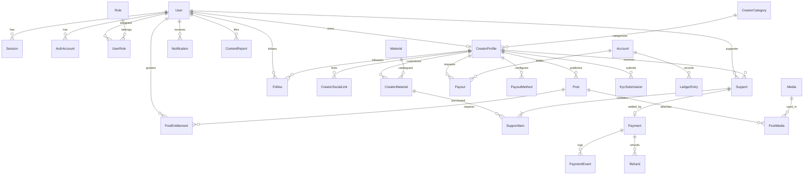

# Buy Me a Yard — Database Schema Specification

This document provides the definitive database architecture, entity relationships, data dictionary, and financial invariants for **Buy Me a Yard** on PostgreSQL via Prisma ORM.

---

## 1. Architectural Principles

1. **Integer Money Precision (Kobo):**
   - All financial values (`amount`, `subtotal`, `creatorAmount`, `platformFee`, `totalAmount`, `unitPrice`, `totalPrice`) are stored as **64-bit integer minor currency units (Kobo for NGN)**.
   - Decimals/floats are prohibited to eliminate rounding and precision errors.
2. **Immutable Double-Entry Financial Ledger:**
   - Account balances are never stored in a mutable balance column.
   - Creator and Platform balances are derived strictly by summing immutable credit and debit entries in `ledger_entries`.
   - Every financial event creates paired entries linked by a shared `transactionId`.
3. **Historical Snapshotting:**
   - Item prices and material names are frozen at the exact time of support creation (`support_items.unitPrice`, `support_items.materialNameSnapshot`). Subsequent creator menu updates never alter past receipts.
4. **Idempotent Webhook Processing:**
   - Webhook deliveries from payment providers (Paystack) are recorded in `payment_events` with a unique constraint on `(provider, providerEventId)` to guarantee at-most-once financial execution.
5. **Session Identity & RBAC Separation:**
   - Better Auth manages sessions, account credentials, and verifications.
   - Domain roles are managed in a dedicated relational RBAC schema (`roles`, `user_roles`).

---

## 2. Entity-Relationship Diagram (ERD)

---

## 3. Data Dictionary

### 3.1 Identity & Authentication (Better Auth & RBAC)

#### `users`
Core user identity for both creators and supporters.

| Column | Type | Nullable | Default | Constraints / References | Description |
| :--- | :--- | :---: | :---: | :--- | :--- |
| `id` | `UUID` | No | `uuid()` | `PRIMARY KEY` | Unique internal user ID |
| `email` | `VARCHAR` | No | — | `UNIQUE` | Normalized user email |
| `emailVerified` | `BOOLEAN` | No | `false` | — | Email verification status |
| `name` | `VARCHAR` | Yes | `NULL` | — | User display/legal name |
| `image` | `VARCHAR` | Yes | `NULL` | — | Profile picture URL |
| `status` | `VARCHAR` | No | `'ACTIVE'` | `'ACTIVE', 'SUSPENDED', 'BANNED', 'DEACTIVATED'` | Administrative status |
| `createdAt` | `TIMESTAMPTZ` | No | `now()` | — | Record creation timestamp |
| `updatedAt` | `TIMESTAMPTZ` | No | `now()` | Auto-updated | Record modification timestamp |

#### `sessions`
Active user authentication sessions (Better Auth).

| Column | Type | Nullable | Default | Constraints / References | Description |
| :--- | :--- | :---: | :---: | :--- | :--- |
| `id` | `UUID` | No | `uuid()` | `PRIMARY KEY` | Unique session ID |
| `userId` | `UUID` | No | — | `FK -> users(id) ON DELETE CASCADE` | Session owner |
| `token` | `VARCHAR` | No | — | `UNIQUE` | Opaque session token |
| `expiresAt` | `TIMESTAMPTZ` | No | — | — | Session expiration timestamp |
| `ipAddress` | `VARCHAR` | Yes | `NULL` | — | Client IP address |
| `userAgent` | `VARCHAR` | Yes | `NULL` | — | Client User-Agent |
| `createdAt` | `TIMESTAMPTZ` | No | `now()` | — | Session issue timestamp |
| `updatedAt` | `TIMESTAMPTZ` | No | `now()` | Auto-updated | Session refresh timestamp |

#### `auth_accounts`
Authentication credentials and OAuth accounts (Better Auth).

| Column | Type | Nullable | Default | Constraints / References | Description |
| :--- | :--- | :---: | :---: | :--- | :--- |
| `id` | `UUID` | No | `uuid()` | `PRIMARY KEY` | Account link record ID |
| `userId` | `UUID` | No | — | `FK -> users(id) ON DELETE CASCADE` | Associated user |
| `accountId` | `VARCHAR` | No | — | — | Provider-specific account ID or user ID |
| `providerId` | `VARCHAR` | No | — | — | `'credential'`, `'google'`, `'apple'`, etc. |
| `password` | `VARCHAR` | Yes | `NULL` | — | Hashed password (argon2 / scrypt) |
| `accessToken` | `TEXT` | Yes | `NULL` | — | OAuth access token |
| `refreshToken`| `TEXT` | Yes | `NULL` | — | OAuth refresh token |
| `idToken` | `TEXT` | Yes | `NULL` | — | OpenID Connect ID token |
| `expiresAt` | `TIMESTAMPTZ` | Yes | `NULL` | — | Token expiry timestamp |
| `createdAt` | `TIMESTAMPTZ` | No | `now()` | — | Record creation timestamp |
| `updatedAt` | `TIMESTAMPTZ` | No | `now()` | Auto-updated | Record modification timestamp |

*Constraint:* `UNIQUE(providerId, accountId)`

#### `verifications`
One-time tokens for password reset and email verification.

| Column | Type | Nullable | Default | Constraints | Description |
| :--- | :--- | :---: | :---: | :--- | :--- |
| `id` | `UUID` | No | `uuid()` | `PRIMARY KEY` | Record ID |
| `identifier` | `VARCHAR` | No | — | — | User email or phone number |
| `value` | `VARCHAR` | No | — | — | Hashed verification token |
| `expiresAt` | `TIMESTAMPTZ` | No | — | — | Expiration timestamp |
| `createdAt` | `TIMESTAMPTZ` | No | `now()` | — | Creation timestamp |
| `updatedAt` | `TIMESTAMPTZ` | No | `now()` | — | Update timestamp |

*Constraint:* `UNIQUE(identifier, value)`

#### `roles` & `user_roles`
Role-Based Access Control (RBAC) model.

| Table | Column | Type | Constraints | Description |
| :--- | :--- | :--- | :--- | :--- |
| `roles` | `id` | `UUID` | `PRIMARY KEY` | Unique role identifier |
| `roles` | `name` | `VARCHAR` | `UNIQUE` | `SUPPORTER`, `CREATOR`, `ADMIN`, `SUPER_ADMIN`, `MODERATOR`, `FINANCE`, `SUPPORT` |
| `user_roles` | `userId` | `UUID` | `FK -> users(id) ON DELETE CASCADE` | Assigned user |
| `user_roles` | `roleId` | `UUID` | `FK -> roles(id) ON DELETE CASCADE` | Assigned role |

*Constraint:* `PRIMARY KEY(userId, roleId)`

---

### 3.2 Creator Profiles & Materials Catalogue

#### `creator_profiles`
Public and verified profile configuration for creators.

| Column | Type | Nullable | Default | Constraints | Description |
| :--- | :--- | :---: | :---: | :--- | :--- |
| `id` | `UUID` | No | `uuid()` | `PRIMARY KEY` | Creator profile ID |
| `userId` | `UUID` | No | — | `UNIQUE, FK -> users(id)` | Associated user account |
| `username` | `VARCHAR` | No | — | `UNIQUE, INDEX` | Handle (e.g. `/adeola`) |
| `displayName`| `VARCHAR` | No | — | — | Public creator title |
| `bio` | `TEXT` | Yes | `NULL` | — | Creator mission/biography |
| `avatarUrl` | `VARCHAR` | Yes | `NULL` | — | Display avatar asset URL |
| `coverUrl` | `VARCHAR` | Yes | `NULL` | — | Banner asset URL |
| `categoryId` | `UUID` | Yes | `NULL` | `INDEX, FK -> creator_categories(id)` | Creator genre / category |
| `status` | `VARCHAR` | No | `'REGISTERED'` | `'REGISTERED', 'PROFILE_CREATED', 'KYC_PENDING', 'VERIFIED', 'ACTIVE', 'SUSPENDED'` | Creator lifecycle state |
| `kycStatus` | `VARCHAR` | No | `'NOT_SUBMITTED'` | `'NOT_SUBMITTED', 'PENDING', 'VERIFIED', 'REJECTED', 'NEEDS_REVIEW'` | Identity compliance state |
| `createdAt` | `TIMESTAMPTZ` | No | `now()` | — | Onboarding timestamp |
| `updatedAt` | `TIMESTAMPTZ` | No | `now()` | Auto-updated | Last updated timestamp |

#### `materials`
Platform-wide catalogue of culturally relevant yard types.

| Column | Type | Nullable | Default | Constraints | Description |
| :--- | :--- | :---: | :---: | :--- | :--- |
| `id` | `UUID` | No | `uuid()` | `PRIMARY KEY` | Material identifier |
| `name` | `VARCHAR` | No | — | — | e.g. *Ankara*, *Lace*, *Aso-oke*, *Adire* |
| `slug` | `VARCHAR` | No | — | `UNIQUE` | URL slug (e.g. `ankara`) |
| `description`| `TEXT` | Yes | `NULL` | — | Cultural background / details |
| `imageUrl` | `VARCHAR` | Yes | `NULL` | — | Catalogue asset icon/image |
| `defaultPrice`| `INT` | No | `0` | Minor units (Kobo) | Platform benchmark price |
| `currency` | `VARCHAR` | No | `'NGN'` | ISO 4217 | Currency code |
| `status` | `VARCHAR` | No | `'ACTIVE'` | `'ACTIVE', 'INACTIVE'` | Availability flag |

#### `creator_materials`
Creator-specific customization of yard menu items.

| Column | Type | Nullable | Default | Constraints | Description |
| :--- | :--- | :---: | :---: | :--- | :--- |
| `id` | `UUID` | No | `uuid()` | `PRIMARY KEY` | Custom menu item ID |
| `creatorId` | `UUID` | No | — | `INDEX, FK -> creator_profiles(id)` | Creator profile |
| `materialId` | `UUID` | No | — | `FK -> materials(id)` | Platform material reference |
| `price` | `INT` | No | — | Minor units (Kobo) | Creator's custom yard price |
| `displayName`| `VARCHAR` | Yes | `NULL` | — | Optional custom title |
| `status` | `VARCHAR` | No | `'ACTIVE'` | `'ACTIVE', 'INACTIVE'` | Creator menu availability |

*Constraint:* `UNIQUE(creatorId, materialId)`

---

### 3.3 Supports, Payments & Financial Ledger

#### `supports`
Represents an intent or completed purchase of yards for a creator.

| Column | Type | Nullable | Default | Constraints | Description |
| :--- | :--- | :---: | :---: | :--- | :--- |
| `id` | `UUID` | No | `uuid()` | `PRIMARY KEY` | Support transaction ID |
| `supporterId` | `UUID` | No | — | `INDEX, FK -> users(id)` | Supporter user account |
| `creatorId` | `UUID` | No | — | `INDEX, FK -> creator_profiles(id)` | Recipient creator |
| `subtotal` | `INT` | No | — | Minor units (Kobo) | Sum of item totals |
| `platformFee` | `INT` | No | — | Minor units (Kobo) | Platform share (e.g. 10%) |
| `creatorAmount`| `INT` | No | — | Minor units (Kobo) | Creator share (`subtotal - platformFee`) |
| `totalAmount` | `INT` | No | — | Minor units (Kobo) | Total payable (`creatorAmount + platformFee`) |
| `currency` | `VARCHAR` | No | `'NGN'` | ISO 4217 | Currency code |
| `message` | `TEXT` | Yes | `NULL` | — | Supporter message |
| `isAnonymous` | `BOOLEAN` | No | `false` | — | Anonymity flag |
| `status` | `VARCHAR` | No | `'CREATED'` | `'CREATED', 'PAYMENT_PENDING', 'PAID', 'COMPLETED', 'PAYMENT_FAILED', 'REFUNDED'` | Support order lifecycle |

#### `support_items`
Itemized line-items with historical price snapshotting.

| Column | Type | Nullable | Default | Constraints | Description |
| :--- | :--- | :---: | :---: | :--- | :--- |
| `id` | `UUID` | No | `uuid()` | `PRIMARY KEY` | Support line item ID |
| `supportId` | `UUID` | No | — | `FK -> supports(id) ON DELETE CASCADE` | Parent support order |
| `creatorMaterialId` | `UUID` | No | — | `FK -> creator_materials(id) ON DELETE RESTRICT` | Source material |
| `materialNameSnapshot`| `VARCHAR` | No | — | — | **Snapshot** of material name at purchase |
| `unitPrice` | `INT` | No | — | Minor units | **Snapshot** of yard price at purchase |
| `quantity` | `INT` | No | — | Positive integer | Number of yards bought (`> 0`) |
| `totalPrice` | `INT` | No | — | Minor units | `unitPrice * quantity` |

#### `payments`
Gateway payment tracking (Paystack).

| Column | Type | Nullable | Default | Constraints | Description |
| :--- | :--- | :---: | :---: | :--- | :--- |
| `id` | `UUID` | No | `uuid()` | `PRIMARY KEY` | Payment record ID |
| `supportId` | `UUID` | No | — | `UNIQUE, FK -> supports(id)` | 1:1 link with Support order |
| `provider` | `VARCHAR` | No | `'PAYSTACK'` | — | Payment gateway |
| `providerReference` | `VARCHAR` | No | — | `INDEX` | Unique payment reference code |
| `amount` | `INT` | No | — | Minor units (Kobo) | Amount charged |
| `status` | `VARCHAR` | No | `'PENDING'` | `'PENDING', 'SUCCESS', 'FAILED', 'REFUNDED'` | Gateway state |
| `paidAt` | `TIMESTAMPTZ` | Yes | `NULL` | — | Payment confirmation time |

*Constraint:* `UNIQUE(provider, providerReference)`

#### `payment_events`
Audit log of all incoming payment provider webhooks guaranteeing idempotency.

| Column | Type | Nullable | Default | Constraints | Description |
| :--- | :--- | :---: | :---: | :--- | :--- |
| `id` | `UUID` | No | `uuid()` | `PRIMARY KEY` | Webhook event log ID |
| `paymentId` | `UUID` | No | — | `FK -> payments(id)` | Target payment record |
| `provider` | `VARCHAR` | No | `'PAYSTACK'` | — | Gateway name |
| `eventType` | `VARCHAR` | No | — | — | e.g. `'charge.success'` |
| `providerEventId`| `VARCHAR` | No | — | — | Gateway event unique identifier |
| `payload` | `JSONB` | No | — | — | Raw webhook payload |
| `processedAt` | `TIMESTAMPTZ` | No | `now()` | — | Processing timestamp |

*Constraint:* `UNIQUE(provider, providerEventId)`

#### `accounts`
Virtual financial accounts for creators and the platform.

| Column | Type | Nullable | Default | Constraints | Description |
| :--- | :--- | :---: | :---: | :--- | :--- |
| `id` | `UUID` | No | `uuid()` | `PRIMARY KEY` | Financial account ID |
| `ownerType` | `VARCHAR` | No | — | `'CREATOR'`, `'PLATFORM'` | Account classification |
| `ownerId` | `VARCHAR` | No | — | — | `creatorProfile.id` or `'PLATFORM'` |
| `currency` | `VARCHAR` | No | `'NGN'` | ISO 4217 | Account currency |
| `status` | `VARCHAR` | No | `'ACTIVE'` | `'ACTIVE', 'FROZEN', 'CLOSED'` | Operating status |

*Constraint:* `UNIQUE(ownerType, ownerId, currency)`

#### `ledger_entries`
Immutable double-entry ledger entries.

| Column | Type | Nullable | Default | Constraints | Description |
| :--- | :--- | :---: | :---: | :--- | :--- |
| `id` | `UUID` | No | `uuid()` | `PRIMARY KEY` | Immutable entry ID |
| `accountId` | `UUID` | No | — | `INDEX, FK -> accounts(id) ON DELETE RESTRICT` | Target account |
| `transactionId` | `VARCHAR` | No | — | `INDEX` | Correlation ID tying credit & debit |
| `entryType` | `VARCHAR` | No | — | `'SUPPORT_PAYMENT', 'PLATFORM_FEE', 'PAYOUT_RESERVATION', 'PAYOUT_COMPLETED', 'PAYOUT_REVERSED', 'REFUND'` | Business transaction type |
| `direction` | `VARCHAR` | No | — | `'CREDIT'`, `'DEBIT'` | Entry direction |
| `amount` | `INT` | No | — | Positive integer (minor units) | Value |
| `reference` | `VARCHAR` | No | — | — | External reference (e.g. `PAY-...`) |
| `metadata` | `JSONB` | Yes | `NULL` | — | Additional context |
| `createdAt` | `TIMESTAMPTZ` | No | `now()` | `INDEX` | Immutable posting timestamp |

---

### 3.4 Content, Media & Social

#### `posts` & `post_entitlements`
Creator updates and supporter-exclusive content.

| Table | Column | Type | Constraints | Description |
| :--- | :--- | :--- | :--- | :--- |
| `posts` | `id` | `UUID` | `PRIMARY KEY` | Post identifier |
| `posts` | `creatorId` | `UUID` | `INDEX, FK -> creator_profiles(id)` | Author creator |
| `posts` | `title` | `VARCHAR` | — | Post title |
| `posts` | `body` | `TEXT` | — | Post markdown / content |
| `posts` | `visibility` | `VARCHAR` | `'PUBLIC'`, `'EXCLUSIVE'` | Access gate |
| `posts` | `status` | `VARCHAR` | `'DRAFT'`, `'PUBLISHED'`, `'ARCHIVED'` | Publishing state |
| `post_entitlements` | `id` | `UUID` | `PRIMARY KEY` | Entitlement record |
| `post_entitlements` | `postId` | `UUID` | `FK -> posts(id)` | Target post |
| `post_entitlements` | `supporterId`| `UUID` | `FK -> users(id)` | Entitled supporter |
| `post_entitlements` | `grantedBy` | `VARCHAR` | `'SUPPORT'`, `'ADMIN'`, `'GIFT'` | Grant mechanism |

*Constraint:* `UNIQUE(postId, supporterId)` on `post_entitlements`.

#### `follows`
Creator followership relationships.

| Column | Type | Constraints | Description |
| :--- | :--- | :--- | :--- |
| `supporterId` | `UUID` | `FK -> users(id) ON DELETE CASCADE` | Follower |
| `creatorId` | `UUID` | `FK -> creator_profiles(id) ON DELETE CASCADE` | Creator being followed |
| `createdAt` | `TIMESTAMPTZ` | Default `now()` | Follow timestamp |

*Constraint:* `PRIMARY KEY(supporterId, creatorId)`

---

### 3.5 Compliance, KYC & Audit

#### `kyc_submissions`
Identity verification records for creators.

| Column | Type | Nullable | Default | Description |
| :--- | :--- | :---: | :---: | :--- |
| `id` | `UUID` | No | `uuid()` | Submission ID |
| `creatorId` | `UUID` | No | — | `FK -> creator_profiles(id)` |
| `provider` | `VARCHAR` | No | `'DEFAULT'` | Identity verification vendor |
| `status` | `VARCHAR` | No | `'PENDING'` | `'PENDING', 'VERIFIED', 'REJECTED', 'NEEDS_REVIEW'` |
| `metadata` | `JSONB` | Yes | `NULL` | Document hashes & verification logs |

#### `audit_logs`
Security and administrative action audit trail.

| Column | Type | Nullable | Constraints | Description |
| :--- | :--- | :---: | :--- | :--- |
| `id` | `UUID` | No | `PRIMARY KEY` | Unique log entry ID |
| `actorId` | `UUID` | Yes | `INDEX` | User ID who took the action |
| `action` | `VARCHAR` | No | — | e.g. `'USER_SUSPENDED'`, `'PAYOUT_APPROVED'` |
| `resourceType` | `VARCHAR` | No | `INDEX` | e.g. `'USER'`, `'CREATOR_PROFILE'`, `'PAYOUT'` |
| `resourceId` | `VARCHAR` | No | `INDEX` | Target entity ID |
| `previousState` | `JSONB` | Yes | — | Before snapshot |
| `newState` | `JSONB` | Yes | — | After snapshot |
| `ipAddress` | `VARCHAR` | Yes | — | Client IP |
| `createdAt` | `TIMESTAMPTZ` | No | `INDEX` | Action timestamp |
