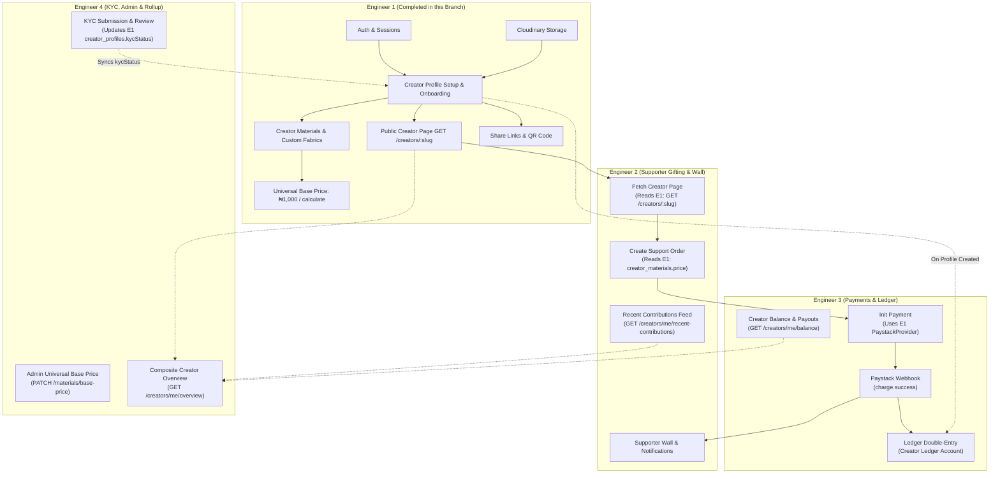

# Buy Me a Yard — Engineer 1 Branch Handoff & Technical Documentation

> **Branch:** `feature/auth-flow-updates`  
> **Author:** Engineer 1 (Creator Identity, Authentication, Profiles, Storage & Material Catalogue)  
> **Target Base:** `dev`  
> **Test Status:** ✅ 22 Test Suites Passing | 205 Unit & Integration Tests Passing  
> **Related Documents:** [`docs/USER_FLOW_DOMAIN_MAPPING.md`](file:///Users/user/Documents/Github/buymeayard-backend/docs/USER_FLOW_DOMAIN_MAPPING.md), [`docs/DATABASE_SCHEMA.md`](file:///Users/user/Documents/Github/buymeayard-backend/docs/DATABASE_SCHEMA.md), [`docs/CREATOR_DASHBOARD_OVERVIEW_ENDPOINTS.md`](file:///Users/user/Documents/Github/buymeayard-backend/docs/CREATOR_DASHBOARD_OVERVIEW_ENDPOINTS.md)

---

## 1. Domain Scope & Responsibility (Engineer 1)

In accordance with [`docs/USER_FLOW_DOMAIN_MAPPING.md`](file:///Users/user/Documents/Github/buymeayard-backend/docs/USER_FLOW_DOMAIN_MAPPING.md), the backend architecture is divided into 4 core engineering domains:

| Role | Domain Name | Modules Owned | Primary Database Entities |
| :--- | :--- | :--- | :--- |
| **Engineer 1 (This Branch)** | **Creator Identity, Profiles, Storage & Material Catalogue** | `auth`, `users`, `creators`, `materials`, `content`, `infrastructure/storage` | `users`, `sessions`, `auth_accounts`, `creator_profiles`, `creator_social_links`, `materials`, `creator_materials`, `posts`, `media` |
| **Engineer 2** | Supporter Gifting, Wall & Real-Time Alerts | `supporters`, `supports`, `follows`, `notifications` | `supports`, `support_items`, `follows`, `notifications` |
| **Engineer 3** | Payments, Ledger & Creator Payouts | `payments`, `ledger`, `payouts` | `payments`, `payment_events`, `accounts`, `ledger_entries`, `payouts`, `payout_methods`, `refunds` |
| **Engineer 4** | KYC Verification, Platform Admin & Dashboard Rollup | `kyc`, `admin`, `analytics`, `moderation` | `kyc_submissions`, `audit_logs`, `content_reports` |

This document provides a full breakdown of everything built, refactored, and tested on branch `feature/auth-flow-updates` by **Engineer 1**, highlighting the precise touchpoints where **Engineer 2, Engineer 3, Engineer 4, and Frontend Engineers** plug in.

---

## 2. Executive Summary of What Was Done

On `feature/auth-flow-updates`, Engineer 1 delivered the foundational services, database migrations, and public/admin API surfaces required for Creator Onboarding, Public Creator Support Pages, Fabric Materials Management, File Storage, and OAuth Authentication:

1. **Universal Yard Base Pricing Architecture & Seeding:**
   - Established the platform universal base price per yard: **₦1,000 (100,000 kobo / minor units)**.
   - Seeded and standardized all 6 platform fabrics matching the Figma Hi-Fi design: **Ankara**, **Adire**, **Ochafu**, **Aso-Oke**, **Akwete**, and **Lace**.
   - Implemented an admin endpoint to update the universal base price across all materials, with an optional cascading sync to update existing creator materials.
2. **Dynamic Yard Calculation Engine (`/materials/calculate`):**
   - Implemented bidirectional conversion: converts an inputted Naira amount into equivalent whole yards with remainder calculations, or computes total cost from a requested yard quantity.
3. **Platform Materials CRUD Endpoints (Admin Controlled):**
   - Full RESTful CRUD for materials: Add (`POST /materials`), Update (`PATCH /materials/:id`), Soft/Hard Delete with transactional integrity (`DELETE /materials/:id`), and query by ID or slug (`GET /materials/:idOrSlug`).
   - Transactional safety: Prevents hard-deleting materials associated with existing financial support orders (`support_items`), automatically soft-deleting them (`status = 'INACTIVE'`).
4. **Creator Custom Materials / Support Page Appearance:**
   - Database schema migration adding `creatorId` to `materials` (foreign key to `creator_profiles` with `CASCADE` delete).
   - Allows creators to add their own custom fabric appearance (`POST /api/v1/creators/me/materials/custom`) which auto-generates scoped slugs and adds to their active menu.
   - Flexible pricing: Creators can now omit custom pricing to inherit the platform base price automatically.
5. **Real Cloudinary Storage Provider:**
   - Replaced development mock storage with a production-ready `CloudinaryStorageProvider` using buffer streams (`uploadFile`, `deleteFile`, `getSignedUrl`).
   - Includes graceful fallback for local development if Cloudinary credentials are omitted.
6. **Paystack API Integration with Resilient Fallback:**
   - Integrated live Paystack transaction initialization (`https://api.paystack.co/transaction/initialize`) and verification (`https://api.paystack.co/transaction/verify/{ref}`).
   - Embedded automated fallback for offline CI/test environments to ensure non-blocking local runs.
7. **Apple OAuth Dynamic Client Secret Generation:**
   - Built native ES256 JWT generation for Apple OAuth (`generateAppleClientSecret`), dynamically deriving Apple client secrets from private keys (`.p8`) for up to 180 days.
   - Configured trusted origins for Render and Apple ID domains.
8. **Creator Profiles, Share Links & Onboarding (Flows 1, 2, 4, 7):**
   - Real-time slug availability checker (`GET /api/v1/creators/check-slug`).
   - Creator Onboarding submission (`PUT /api/v1/creators/me/onboarding`).
   - Share Link & QR Code generation with pre-populated social intents for Twitter, WhatsApp, Facebook, LinkedIn, and Telegram (`GET /api/v1/creators/me/share-link` and `GET /api/v1/creators/:slug/share-link`).

---

## 3. Detailed Component Breakdown

### 3.1. Universal Platform Base Price & Materials Catalogue

#### Background
In the Figma UI, yard gifting revolves around a standard base price per yard (₦1,000 = 100,000 kobo). Previously, materials lacked a unified platform pricing standard and complete fabric catalogue.

#### What was implemented:
- **Default Catalogue Seed:** Populates `Ankara`, `Adire`, `Ochafu`, `Aso-Oke`, `Akwete`, and `Lace`, each initialized with `defaultPrice = 100000` (₦1,000) and `currency = 'NGN'`.
- **Get Universal Base Price (`GET /api/v1/materials/base-price`):**
  - Public endpoint.
  - Returns major units (`basePrice: 1000`), minor units (`basePriceMinor: 100000`), currency, and an array of all active platform materials with their prices.
  - Self-healing: Automatically provisions default materials if database is empty.
- **Update Universal Base Price (`PATCH /api/v1/materials/base-price`):**
  - Protected: Admin and Super Admin only (`@Roles(UserRole.ADMIN, UserRole.SUPER_ADMIN)`).
  - Accepts `price` (supports both major and minor units; converts amounts `< 10000` from major to kobo automatically).
  - Optional flag `updateCreatorMaterials: true`: When enabled, executes a bulk update across all active `creator_materials` in the database, resetting creator offerings to the new base price.

#### Yard Calculation Engine (`GET /api/v1/materials/calculate`):
Enables supporters or frontend clients to compute yard gifting conversions on the fly:
- **Amount-to-Yards (`?amount=50000`):**
  ```json
  {
    "basePricePerYard": 1000,
    "basePriceMinor": 100000,
    "currency": "NGN",
    "inputAmount": 50000,
    "calculatedYards": 50,
    "effectiveAmount": 50000,
    "effectiveAmountMinor": 5000000,
    "remainder": 0,
    "summary": "50,000 NGN gifts 50 yards of material at 1,000 NGN per yard."
  }
  ```
- **Yards-to-Amount (`?yards=15`):**
  ```json
  {
    "basePricePerYard": 1000,
    "basePriceMinor": 100000,
    "currency": "NGN",
    "yards": 15,
    "totalAmount": 15000,
    "totalAmountMinor": 1500000,
    "summary": "15 yards of material equals 15,000 NGN at 1,000 NGN per yard."
  }
  ```

---

### 3.2. Platform Materials Admin CRUD

To allow platform operations without database access:
- **`POST /api/v1/materials` (Create Material):**
  - Admin/Super Admin only.
  - Creates a new platform fabric. Auto-cleans slug, checks uniqueness (`ConflictException` on duplicate), and applies platform universal base price.
- **`PATCH /api/v1/materials/:id` (Update Material):**
  - Admin/Super Admin only.
  - Modifies `name`, `slug`, `description`, `imageUrl`, or `status` (`ACTIVE`/`INACTIVE`).
- **`DELETE /api/v1/materials/:id` (Delete Material):**
  - Admin/Super Admin only.
  - **Financial Safety Mechanism:** Inspects if any `creator_materials` linked to this material have associated `supportItems`. If historical orders exist, it **soft-deletes** (`status = 'INACTIVE'`) to preserve ledger history. If clean, it permanently hard-deletes the record.
- **`GET /api/v1/materials/:idOrSlug`:**
  - Public endpoint. Supports lookup by UUID or slug (`ankara`, `adire`, etc.).
- **`GET /api/v1/materials?all=true`:**
  - Supports `all=true` query param to list both active and inactive materials for admin management.

---

### 3.3. Creator Custom Materials (Support Page Appearance)

#### Figma Context:
Creators can personalize their support page appearance by selecting standard materials or adding custom material offerings.

#### What was implemented:
- **Prisma Schema Update:**
  ```prisma
  model Material {
    id               String           @id @default(uuid())
    creatorId        String?          // null for platform, creatorProfile.id for custom
    name             String
    slug             String           @unique
    description      String?
    imageUrl         String?
    defaultPrice     Int              @default(100000)
    currency         String           @default("NGN")
    status           String           @default("ACTIVE")
    createdAt        DateTime         @default(now())
    updatedAt        DateTime         @updatedAt

    creator          CreatorProfile?  @relation("CustomMaterials", fields: [creatorId], references: [id], onDelete: Cascade)
    creatorMaterials CreatorMaterial[]

    @@index([creatorId])
    @@map("materials")
  }
  ```
- **Migration:** `20261001171500_add_creator_id_to_materials/migration.sql`.
- **`POST /api/v1/creators/me/materials/custom`:**
  - Authenticated creator endpoint.
  - Body: `{ name: "Silk Georgette", imageUrl?: "...", description?: "..." }`.
  - Generates a scoped unique slug: `${profile.slug}-${cleanName}-${random5}`.
  - Creates the `Material` (with `creatorId = profile.id`) and instantly links it in `CreatorMaterial`.
  - Sets `isCustom: true` in response.
- **`GET /api/v1/creators/me/materials`:**
  - Returns creator's configured materials, adding boolean flag `isCustom: Boolean(item.material?.creatorId)`.
- **`PUT /api/v1/creators/me/materials` (Save Creator Materials):**
  - Allows creators to select both platform materials (`creatorId: null`) and their own custom materials (`creatorId: profile.id`).
  - **Price Fallback:** `price` in payload is optional. If omitted by creator, it automatically falls back to the material's default platform base price (`defaultPrice`).

---

### 3.4. Cloudinary Storage Provider

#### What was implemented:
- Implemented [`CloudinaryStorageProvider`](file:///Users/user/Documents/Github/buymeayard-backend/apps/api/src/infrastructure/storage/cloudinary-storage.provider.ts) implementing [`StorageProvider`](file:///Users/user/Documents/Github/buymeayard-backend/apps/api/src/infrastructure/storage/storage-provider.interface.ts).
- Integrated official `cloudinary` v2 SDK.
- Upload stream handles memory buffers from file uploads (`upload_stream`), returning `storageKey`, `url`, `secureUrl`, `bytes`, and `format`.
- Configured folder management (`avatars`, `materials`, `buymeayard`).
- Configured resilient local mock fallback if environment variables are not supplied.

---

### 3.5. Paystack Payment Provider

#### What was implemented:
- Integrated real HTTP calls in [`PaystackProvider`](file:///Users/user/Documents/Github/buymeayard-backend/apps/api/src/infrastructure/payments/paystack.provider.ts):
  - `initializePayment()`: Calls `POST https://api.paystack.co/transaction/initialize` with `email`, `amount`, `reference`, `callback_url`, and `metadata`. Extracts `authorization_url`, `access_code`, and `reference`.
  - `verifyPayment()`: Calls `GET https://api.paystack.co/transaction/verify/:reference` with Bearer auth. Validates transaction success, amount, paid timestamp, and metadata.
- Resilient fallback activates automatically if `PAYSTACK_SECRET_KEY` is not configured or set to mock keys, allowing all local unit tests and development mocks to function without network dependencies.

---

### 3.6. Apple OAuth & Dynamic ES256 Secret Generation

#### What was implemented in [`better-auth.ts`](file:///Users/user/Documents/Github/buymeayard-backend/apps/api/src/modules/auth/better-auth.ts):
- Added `generateAppleClientSecret()` using Node.js `crypto` with `prime256v1` / ES256 signing.
- Standard Apple client secrets require generation via `.p8` private keys and expire after a maximum of 180 days.
- Added `resolveAppleClientSecret()`: Prioritizes `APPLE_CLIENT_SECRET` if provided; otherwise dynamically generates a valid signed JWT using `APPLE_CLIENT_ID`, `APPLE_TEAM_ID`, `APPLE_KEY_ID`, and `APPLE_PRIVATE_KEY`.
- Added trusted origins:
  - `https://buymeayardbackend.onrender.com`
  - `https://appleid.apple.com`

---

## 4. Cross-Engineer Integration Guide ("When & Where to Come In")



---

### 4.1. Handoff to Engineer 2 (Supporter Gifting, Wall & Real-Time Alerts)

#### 1. Public Support Page Rendering (Flow 5)
- **Endpoint to call:** `GET /api/v1/creators/:slug`
- **What Engineer 1 provides:**
  - Full creator profile (`creatorName`, `bio`, `avatarUrl`, `slug`).
  - Active materials array: Each item includes `id`, `materialId`, `displayName`, `price` (in kobo), `currency`, `isCustom`, and the nested `material` object (`name`, `slug`, `imageUrl`, `description`).
- **Where Engineer 2 comes in:**
  - Build supporter selection UI using this payload.
  - When supporter clicks "Send Yard", hand off to `POST /api/v1/supports`.

#### 2. Price Snapshotting in `POST /api/v1/supports` (Flow 6)
- **Critical rule:** Never trust client-submitted prices.
- When creating `SupportItem` records, Engineer 2's code queries Engineer 1's `creator_materials` table:
  ```typescript
  const creatorMaterial = await prisma.creatorMaterial.findUnique({
    where: {
      creatorId_materialId: { creatorId: profile.id, materialId: item.materialId },
    },
    include: { material: true },
  });
  ```
- **Price Fallback:** If `creatorMaterial.price` is set, use it; otherwise use `creatorMaterial.material.defaultPrice` (which defaults to platform base price 100,000 kobo).

#### 3. Material Deletion Safeguard
- Engineer 1 has configured `DELETE /api/v1/materials/:id` to check `supportItems`. As long as Engineer 2 links purchases to `support_items.materialId`, materials with transaction history cannot be destroyed.

#### 4. Remaining Flow 7 Endpoints for Engineer 2:
- ⏳ `GET /api/v1/creators/me/recent-contributions`: Feed of last 5 gifts with supporter display names, yard quantities, and fabric badges.

---

### 4.2. Handoff to Engineer 3 (Payments, Ledger & Creator Payouts)

#### 1. Paystack Checkout Initialization (Flow 6)
- **Provider ready:** Engineer 1 has wired `PaystackProvider` into `infrastructure/payments`.
- Engineer 3 can inject `PAYMENT_PROVIDER` and call:
  ```typescript
  const result = await this.paymentProvider.initializePayment({
    paymentId: payment.id,
    amount: support.totalAmount, // in kobo
    email: supporterEmail,
    callbackUrl: `${frontendUrl}/supports/${support.id}/callback`,
    metadata: { supportId: support.id, creatorId: support.creatorId },
  });
  ```

#### 2. Ledger Account Creation (Flow 4 Handoff)
- When a creator completes onboarding via `PUT /api/v1/creators/me/onboarding`, their status transitions to `PROFILE_CREATED`.
- **Where Engineer 3 comes in:** Ensure a `CREATOR` ledger `Account` is provisioned for this `userId` / `creatorProfileId` (either synchronously on onboarding completion or lazily upon their first received payment).

#### 3. Webhook Reconciliation & Support Status (Flow 6)
- On `charge.success` in `/api/v1/webhooks/paystack`:
  - Verify webhook signature.
  - Update `Payment` status to `SUCCESS`.
  - Update Engineer 2's `Support` status to `PAID`.
  - Execute double-entry ledger entries:
    - CREDIT Creator Ledger Account (`netAmount = total - platformFee`).
    - CREDIT Platform Revenue Account (`platformFee`).

#### 4. Remaining Balance Endpoints for Engineer 3:
- ⚠️ Add `pendingBalance` and `withdrawnBalance` to `GET /api/v1/creators/me/balance`.
- ⏳ `GET /api/v1/creators/me/analytics/earnings`: Historical earnings aggregation.

---

### 4.3. Handoff to Engineer 4 (KYC, Platform Admin & Dashboard Rollup)

#### 1. Platform Admin Material & Pricing Governance
- Engineer 4 owns Admin UI/tools. The following endpoints are ready for integration into the Admin Dashboard:
  - `PATCH /api/v1/materials/base-price`: Universal platform yard base price update.
  - `POST /api/v1/materials`: Provision new seasonal or promotional fabrics.
  - `PATCH /api/v1/materials/:id`: Update fabric details or toggle status.
  - `DELETE /api/v1/materials/:id`: Remove or deactivate fabrics.
  - `GET /api/v1/materials?all=true`: Full inventory list including inactive fabrics.

#### 2. KYC Verification Status Sync (Flow 8)
- In Prisma schema, `CreatorProfile` contains:
  ```prisma
  kycStatus  KycStatus  @default(NOT_SUBMITTED) // NOT_SUBMITTED, PENDING, VERIFIED, REJECTED
  ```
- **Where Engineer 4 comes in:** When a creator submits KYC (`POST /api/v1/creators/me/kyc`) and when admin approves/rejects it (`PATCH /api/v1/admin/kyc/:id`), Engineer 4's service updates `creator_profiles.kycStatus`.

#### 3. Composite Creator Overview Endpoint (Flow 7 Rollup)
- **Goal:** Single endpoint `GET /api/v1/creators/me/overview` for creator dashboard home.
- **Orchestration recipe for Engineer 4:**
  ```typescript
  // 1. Identity from Engineer 1
  const profile = await this.creatorsService.findByUserId(userId);
  const shareLink = await this.creatorsService.getShareLink(userId);

  // 2. Contributions from Engineer 2
  const recentGifts = await this.supportsService.getRecentContributions(profile.id);

  // 3. Balance & Financials from Engineer 3
  const balance = await this.ledgerService.getBalance(profile.id);
  const earnings = await this.ledgerService.getEarningsChart(profile.id);

  // 4. KYC Status from Engineer 4
  const kycStatus = profile.kycStatus;
  ```

---

### 4.4. Handoff to Frontend Engineers (Web & Mobile)

#### 1. Real-Time Slug Validation
- `GET /api/v1/creators/check-slug?slug={value}`
- Debounce 300ms on frontend input.
- Response: `{ available: boolean, slug: string, reason?: string }`.
- Automatically strips `@` and rejects reserved paths (`api`, `dashboard`, `admin`, `settings`, etc.).

#### 2. Yard Gifting Calculator on Public Page
- Before initiating payment, call `GET /api/v1/materials/calculate?amount=10000` or `GET /api/v1/materials/calculate?yards=10` to get real-time price totals and summary text.

#### 3. Creator Share Links & QR Code
- `GET /api/v1/creators/me/share-link` (authenticated) or `GET /api/v1/creators/:slug/share-link` (public).
- Returns:
  - `pageUrl`: Full web URL.
  - `qrCodeDataUrl`: Pre-rendered SVG/data URI for instant `` rendering.
  - `socialShareUrls`: Direct intents for `twitter`, `whatsapp`, `facebook`, `linkedin`, `telegram`.

#### 4. Custom Materials Creation
- `POST /api/v1/creators/me/materials/custom`
- Use when creator uploads custom fabric photos on the support page setup screen.

---

## 5. Complete API Reference Table

| Method | Endpoint | Auth / Roles | Purpose | Implemented In Branch |
| :--- | :--- | :--- | :--- | :---: |
| `GET` | `/api/v1/materials` | Public | List active platform fabrics | ✅ |
| `GET` | `/api/v1/materials/base-price` | Public | Get universal base price (₦1,000) & catalogue | ✅ |
| `PATCH` | `/api/v1/materials/base-price` | Admin / Super Admin | Update universal base price; cascade to creators | ✅ |
| `GET` | `/api/v1/materials/calculate` | Public | Bidirectional yard/amount calculator | ✅ |
| `POST` | `/api/v1/materials` | Admin / Super Admin | Create new platform fabric | ✅ |
| `PATCH` | `/api/v1/materials/:id` | Admin / Super Admin | Update platform fabric metadata | ✅ |
| `DELETE` | `/api/v1/materials/:id` | Admin / Super Admin | Delete or soft-deactivate fabric safely | ✅ |
| `GET` | `/api/v1/materials/:idOrSlug` | Public | Lookup material by UUID or slug | ✅ |
| `POST` | `/api/v1/creators/me/materials/custom` | Authenticated Creator | Add custom fabric appearance for creator page | ✅ |
| `GET` | `/api/v1/creators/me/materials` | Authenticated Creator | Get creator's active fabrics with custom flag | ✅ |
| `PUT` | `/api/v1/creators/me/materials` | Authenticated Creator | Save creator fabrics; supports price fallback | ✅ |
| `GET` | `/api/v1/creators/:slug` | Public | Public creator support page & fabrics | ✅ |
| `GET` | `/api/v1/creators/check-slug` | Public | Check handle availability in real-time | ✅ |
| `PUT` | `/api/v1/creators/me/onboarding` | Authenticated | Submit creator onboarding (name, slug, links) | ✅ |
| `POST` | `/api/v1/creators/me/avatar` | Authenticated Creator | Upload avatar to Cloudinary | ✅ |
| `GET` | `/api/v1/creators/me/share-link` | Authenticated Creator | Creator share link, QR code, and social links | ✅ |
| `GET` | `/api/v1/creators/:slug/share-link` | Public | Public share metadata & QR code by slug | ✅ |
| `POST` | `/api/v1/auth/social/sign-in` | Public | Better Auth social sign-in (Google/Apple) | ✅ |

---

## 6. Database Changes & Schema Integrity

### Prisma Schema Diff Summary:
1. **Added Relation:** `creatorId String?` on `Material` referencing `CreatorProfile(id)` with `onDelete: Cascade`.
2. **Added Index:** `@@index([creatorId])` on `materials`.
3. **Relation Name:** `customMaterials Material[] @relation("CustomMaterials")` on `CreatorProfile`.
4. **Migration SQL:**
   ```sql
   ALTER TABLE "materials" ADD COLUMN IF NOT EXISTS "creatorId" TEXT;
   CREATE INDEX IF NOT EXISTS "materials_creatorId_idx" ON "materials"("creatorId");
   ALTER TABLE "materials" ADD CONSTRAINT "materials_creatorId_fkey" 
     FOREIGN KEY ("creatorId") REFERENCES "creator_profiles"("id") ON DELETE CASCADE ON UPDATE CASCADE;
   ```

---

## 7. Verification & Testing

### Test Suite Execution:
Run command:
```bash
pnpm --filter @buymeayard/api test
```

### Result:
- **Test Suites:** 22 passed, 22 total
- **Tests:** 205 passed, 205 total
- **Coverage Areas:**
  - `materials.service.spec.ts`: Universal base price, currency validation, cascading creator updates, calculate formulas, CRUD validations, duplicate slug rejection, soft-delete rules.
  - `materials.controller.spec.ts`: Admin RBAC role guards, route mappings, query parsing.
  - `creators.service.spec.ts`: Custom material creation, slug generation, scoped uniqueness, price fallback logic.
  - `cloudinary-storage.provider.spec.ts`: Stream uploads, key extraction, buffer handling, fallback modes.
  - `paystack.provider.spec.ts`: Live fetch mocking, authorization URL formatting, verification response mapping, test fallback resilience.
  - `better-auth.spec.ts`: Apple ES256 client secret generation, crypto verification against public key, trusted origins.

---

## 8. Engineer 1 Sign-Off & Next Steps

All responsibilities assigned to **Engineer 1** for Authentication, Creator Onboarding, Public Creator Support Page data, Material Management, Storage, and Base Pricing are complete, verified, and documented.

### Recommended Sequence for Team:
1. **Merge `feature/auth-flow-updates` into `dev`**.
2. **Engineer 2** pulls `dev` and completes:
   - Wire `POST /api/v1/supports` with price snapshotting against `creator_materials`.
   - Implement `GET /api/v1/creators/me/recent-contributions`.
3. **Engineer 3** pulls `dev` and completes:
   - Connect `PaystackProvider` inside `payments.service.ts`.
   - Add Paystack webhook listener and update support records to `PAID`.
   - Update `GET /api/v1/creators/me/balance` with pending/withdrawn breakdown.
4. **Engineer 4** pulls `dev` and completes:
   - Connect KYC verification submission flow and status sync to `creator_profiles.kycStatus`.
   - Implement the composite dashboard rollup endpoint `GET /api/v1/creators/me/overview`.
