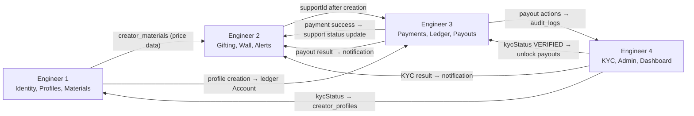

# Buy Me a Yard — User Flow → Domain Mapping

> **Source:** Figma Hi-Fi Designs ([`UDusiQTYGhdYKJJqawxndz`](https://www.figma.com/design/UDusiQTYGhdYKJJqawxndz/Buy-me-a-Yard---Design--UI-?node-id=469-1063))
> **Date:** 2026-09-29
> **Status:** Living document — maps only what is currently visible in the design.

---

## Domain Ownership Reference

| Engineer | Domain Name | Modules Owned | Key DB Tables |
| :--- | :--- | :--- | :--- |
| **Engineer 1** | Creator Identity, Profiles & Material Catalogue | `auth`, `users`, `creators`, `materials`, `content` | `users`, `sessions`, `auth_accounts`, `creator_profiles`, `creator_social_links`, `materials`, `creator_materials`, `posts`, `media` |
| **Engineer 2** | Supporter Gifting, Wall & Real-Time Alerts | `supporters`, `supports`, `follows`, `notifications` | `supports`, `support_items`, `follows`, `notifications` |
| **Engineer 3** | Payments, Ledger & Creator Payouts | `payments`, `ledger`, `payouts` | `payments`, `payment_events`, `accounts`, `ledger_entries`, `payouts`, `payout_methods`, `refunds` |
| **Engineer 4** | KYC Verification, Platform Admin & Dashboard Rollup | `kyc`, `admin`, `analytics`, `moderation` | `kyc_submissions`, `audit_logs`, `content_reports` |

---

## Figma Hi-Fi Design Sections Mapped

| Figma Section | Node ID | Screens Count | Primary Flows |
| :--- | :--- | :--- | :--- |
| Authentication/Onboarding | `517:1764` | ~20 frames | Sign Up, Log In, Forgot/Reset Password, Email Verification |
| External Verification (KYC) | `469:3892` | 5 frames | KYC Intro, During Verification, After Verification, KYC Approved |
| Mobile App | `1026:5421` | ~12 frames | Mobile onboarding, Mobile home/overview |
| Creator Dashboard & Flows (unnamed section) | `1041:2665` | ~60 frames | Dashboard Overview, Page/Profile Setup, Support Page Setup, Public Support Page, Settings, Payouts, Withdrawals, Notifications |

---

## Flow 1: Creator Registration & Sign Up

**User goal:** A new creator registers an account on Buy Me a Yard using email/password or social OAuth (Google/Apple).

**Figma screens:** `Sign up` (#517:1765 → #517:2402, ~14 variants showing form states, OTP/email, social sign-in, success)

**Flow:**

| # | Action | Domain / Engineer |
| :--- | :--- | :--- |
| 1 | User lands on Sign Up page | Frontend (no backend call) |
| 2 | User enters name, email, password | Frontend validation |
| 3 | User submits registration form | **Engineer 1** — `auth` module |
| 4 | Backend creates `users` record, assigns `CREATOR` role, creates session | **Engineer 1** — `auth` module |
| 5 | Verification email sent to user | **Engineer 1** — `auth` module (Better Auth) |
| 6 | User clicks verification link / enters code | **Engineer 1** — `auth` module |
| 7 | Email marked as verified (`emailVerified = true`) | **Engineer 1** — `auth` module |
| 8 | *(Alternative)* User taps "Sign up with Google" | **Engineer 1** — `auth` module (OAuth flow) |
| 9 | Redirect to Google consent screen, callback handled | **Engineer 1** — `auth` module |
| 10 | Session created, user redirected to onboarding | **Engineer 1** — `auth` module |

**Cross-domain handoffs:**
* None — entirely within Engineer 1's domain.

**Existing APIs:**
* `POST /api/v1/auth/register`
* `POST /api/v1/auth/social/sign-in`
* `GET  /api/v1/auth/social/:provider`
* `POST /api/v1/auth/verify-email`
* `POST /api/v1/auth/send-verification-email`
* `GET  /api/v1/auth/session`

**APIs / backend work still required:**
* None — auth flow is fully implemented.

**Design gaps / questions:**
* ⚠️ Multiple "Sign up" frames exist with subtle state differences (form empty, form filled, errors, loading, success). The exact error-state mapping (e.g., "email already exists" vs "weak password") should be confirmed with product.
* ⚠️ One frame (#517:2277) appears to show a post-registration "welcome" or "email sent" confirmation — confirm if this is a distinct step or a toast notification.

---

## Flow 2: Creator Login

**User goal:** An existing creator logs into their account.

**Figma screens:** `Log in` (#517:1808, #517:1968 — empty state, filled state)

**Flow:**

| # | Action | Domain / Engineer |
| :--- | :--- | :--- |
| 1 | User enters email & password | Frontend |
| 2 | User submits login form | **Engineer 1** — `auth` module |
| 3 | Backend validates credentials, creates session | **Engineer 1** — `auth` module |
| 4 | Session cookie set (web) or token returned (mobile) | **Engineer 1** — `auth` module |
| 5 | Redirect to Creator Dashboard | Frontend routing |

**Cross-domain handoffs:**
* None.

**Existing APIs:**
* `POST /api/v1/auth/login`
* `GET  /api/v1/auth/session`

**APIs / backend work still required:**
* None.

**Design gaps / questions:**
* None identified.

---

## Flow 3: Forgot / Reset Password

**User goal:** Creator resets a forgotten password via email.

**Figma screens:** `Forgot password` (#517:1922, #517:1945, #517:1897, #517:1856, #517:2302 — 5 sequential states: enter email, email sent confirmation, enter new password, token validation, success)

**Flow:**

| # | Action | Domain / Engineer |
| :--- | :--- | :--- |
| 1 | User clicks "Forgot password?" on login screen | Frontend |
| 2 | User enters email, submits | **Engineer 1** — `auth` module |
| 3 | Reset token generated, email sent with reset link | **Engineer 1** — `auth` module |
| 4 | User clicks link in email, redirected to reset form | Frontend routing |
| 5 | User enters new password, submits with token | **Engineer 1** — `auth` module |
| 6 | Password updated, user redirected to login | **Engineer 1** — `auth` module |

**Cross-domain handoffs:**
* None.

**Existing APIs:**
* `POST /api/v1/auth/forgot-password`
* `POST /api/v1/auth/reset-password`

**APIs / backend work still required:**
* None.

**Design gaps / questions:**
* None identified.

---

## Flow 4: Creator Profile & Page Setup (Onboarding)

**User goal:** After registration, a creator completes their profile: sets creator name, slug/handle, bio, avatar, social links, and configures their support page with yard materials and custom pricing.

**Figma screens:**
* `Page-Profile setup` (#1342:5868) — profile info side-by-side editor
* `Profile setup` (#1342:6240) — alternate profile state
* `support page setup` (#1342:6614, #1342:6986, #1342:9069, #1342:9504, #1538:13115) — 5+ frames covering material selection, pricing, page preview

**Flow:**

| # | Action | Domain / Engineer |
| :--- | :--- | :--- |
| 1 | User sees Profile Setup page (sidebar nav: "My Page" active) | Frontend |
| 2 | User enters Creator Name | **Engineer 1** — `creators` module |
| 3 | User enters slug/handle (e.g. `@fisayo`), real-time availability check | **Engineer 1** — `creators` module |
| 4 | User uploads avatar image | **Engineer 1** — `creators` module (via Cloudinary `StorageProvider`) |
| 5 | User writes bio/about text | **Engineer 1** — `creators` module |
| 6 | User adds social media links (Twitter, Instagram, etc.) | **Engineer 1** — `creators` module |
| 7 | User clicks "Next" / navigates to Support Page Setup | Frontend |
| 8 | Backend fetches platform material catalogue | **Engineer 1** — `materials` module |
| 9 | User selects which materials to offer (Ankara, Lace, Aso-oke, Adire) | **Engineer 1** — `creators` module (creates `creator_materials`) |
| 10 | User sets custom price per yard for each material | **Engineer 1** — `creators` module (updates `creator_materials.price`) |
| 11 | Live preview of public support page shown | Frontend (reads creator + material data) |
| 12 | User submits/saves onboarding | **Engineer 1** — `creators` module |
| 13 | Creator profile status updated to `PROFILE_CREATED` | **Engineer 1** — `creators` module |
| 14 | *(Post-save)* Ledger account created for creator | **Engineer 3** — `ledger` module |

**Cross-domain handoffs:**
* **Engineer 1 → Engineer 3:** On profile creation completion, a `CREATOR` ledger `Account` record must be created (or lazily created on first payment). Engineer 1 emits an event or Engineer 3 listens to the `creator_profiles.status` change.

**Existing APIs:**
* `GET  /api/v1/creators/check-slug?slug=fisayo` — real-time slug check
* `PUT  /api/v1/creators/me/onboarding` — submit onboarding data (name, slug, social links)
* `PUT  /api/v1/creators/me/profile` — post-onboarding profile update (creatorName, bio)
* `POST /api/v1/creators/me/avatar` — avatar image upload (multipart/form-data via StorageProvider)
* `GET  /api/v1/creators/me/materials` — retrieve creator's configured materials and custom pricing
* `PUT  /api/v1/creators/me/materials` — save / sync creator's material menu with custom pricing
* `GET  /api/v1/materials` — list platform material catalogue
* `GET  /api/v1/materials/:slug` — get specific material details

**APIs / backend work still required:**
* None — Creator profile, avatar upload, and material catalogue configuration endpoints are now implemented.

**Design gaps / questions:**
* ❓ The design shows 5+ "support page setup" frames with different states — need product clarification on: Is this a wizard (multi-step) or a single page with live preview?
* ❓ Frame #1538:13115 labeled "support page setup" appears at a different Y-position than the others — confirm if this is a final confirmation/review step.
* ❓ Can a creator deactivate/reactivate individual materials after initial setup? Design doesn't clearly show material removal UX.

---

## Flow 5: Creator Public Support Page (Supporter View)

**User goal:** A supporter visits a creator's public page, views their profile and available yard materials, and selects materials to send as a gift.

**Figma screens:**
* `Creator Public support page` (#1399:7249) — mobile/responsive creator page
* `Public support page-Adire` (#1468:25487, #1468:25693) — desktop views with specific material (Adire) selected

**Flow:**

| # | Action | Domain / Engineer |
| :--- | :--- | :--- |
| 1 | Supporter navigates to `buymeayard.com/:slug` | Frontend |
| 2 | Fetch creator public profile + materials | **Engineer 1** — `creators` module (public endpoint) |
| 3 | Page renders: creator avatar, name, bio, social links, yard material cards with prices | Frontend |
| 4 | Supporter selects a material (e.g., Adire), chooses quantity | Frontend state |
| 5 | Supporter writes optional message, toggles anonymous | Frontend state |
| 6 | Supporter clicks "Send Yard" / "Support" CTA | Handoff to **Flow 6** |

**Cross-domain handoffs:**
* **Engineer 1 → Engineer 2:** The public page data is served by Engineer 1 (`GET /creators/:slug`), but the support creation action (step 6) hands off to Engineer 2's domain.

**Existing APIs:**
* `GET /api/v1/creators/:slug` — public creator profile with active materials, custom pricing, and material metadata

**APIs / backend work still required:**
* None — verified that `GET /creators/:slug` correctly filters active materials and includes platform material details and custom pricing.
* ⏳ Optional future enhancement: `GET /api/v1/creators/:slug/posts` — exists if public feed/posts section is added to the public page.

**Design gaps / questions:**
* ❓ The design shows both a mobile version (#1399:7249, 390px width) and desktop versions (#1468:25487, #1468:25693). These appear to be the same flow at different breakpoints — confirm no functional differences.
* ❓ Does the public page show creator posts/updates below the material selection? Some Figma frames suggest content below the fold.
* ❓ Is there a "Follow" button on the public page? The `follows` module exists but no follow CTA is visually confirmed on these screens.

---

## Flow 6: Supporter Sends a Yard (Gifting & Payment)

**User goal:** A supporter selects materials, composes a message, and completes payment to send yards to a creator.

**Figma screens:**
* Continuation from Public support page screens — payment modal/page not explicitly shown as a separate named frame in Hi-Fi section.
* `Modal` (#1538:13044) — appears to be a share/action modal overlay

**Flow:**

| # | Action | Domain / Engineer |
| :--- | :--- | :--- |
| 1 | Supporter selects material(s) + quantity on creator's public page | Frontend |
| 2 | Supporter optionally writes message, sets anonymous flag | Frontend |
| 3 | Supporter clicks "Send Yard" | Frontend |
| 4 | Backend creates `Support` record with `SupportItems`, server computes prices | **Engineer 2** — `supports` module |
| 5 | Backend reads `creator_materials.price` for price snapshot | **Engineer 2** reads from **Engineer 1's** `creator_materials` table |
| 6 | Backend calculates subtotal, platform fee, creator amount | **Engineer 2** — `supports` module (server-authoritative) |
| 7 | `Support` created with status `CREATED` | **Engineer 2** — `supports` module |
| 8 | Frontend receives `supportId`, calls payment initialization | Frontend |
| 9 | Backend initializes Paystack checkout (generates authorization URL) | **Engineer 3** — `payments` module |
| 10 | Supporter redirected to Paystack payment page | External (Paystack) |
| 11 | Paystack sends webhook `charge.success` | **Engineer 3** — `payments` module |
| 12 | Backend verifies webhook signature (HMAC-SHA512) | **Engineer 3** — `payments` module |
| 13 | `Payment` record updated to `SUCCESS`, `Support` status → `PAID` | **Engineer 3** → updates **Engineer 2's** `supports` table |
| 14 | Ledger entries created: CREDIT to creator account + CREDIT to platform account | **Engineer 3** — `ledger` module |
| 15 | Notification sent to creator: "X sent you Y" | **Engineer 2** — `notifications` module |
| 16 | *(Optional)* Real-time alert pushed to creator dashboard | **Engineer 2** — `notifications` module |

**Cross-domain handoffs:**
* **Engineer 2 → Engineer 3:** After `Support` creation (step 7), `supportId` is passed to `payments/initialize` (step 9).
* **Engineer 3 → Engineer 2:** After successful payment webhook (step 13), Engineer 3 updates the `supports.status` to `PAID`/`COMPLETED`.
* **Engineer 3 → Engineer 3:** Ledger entries are internally within Engineer 3's domain.
* **Engineer 3 → Engineer 2:** After ledger credit, a notification must be triggered (step 15). Either Engineer 3 emits an event or directly calls notification service.
* **Engineer 2 reads Engineer 1's data:** Support creation needs to read `creator_materials` for price snapshotting (step 5).

**Existing APIs:**
* `POST /api/v1/supports` — create support order
* `GET  /api/v1/supports/:id` — get support details
* `POST /api/v1/payments/initialize` — initialize Paystack checkout
* `POST /api/v1/webhooks/paystack` — handle webhook (public, signature-verified)

**APIs / backend work still required:**
* ✅ Self-support prevention — verified implemented in `supports.service.ts` (rejects `creator.userId === supporterUserId`).
* ⏳ Notification creation after successful payment — wiring between `payments` webhook handler and `notifications` service.
* ⏳ Real-time push notification delivery (WebSocket / SSE) — infrastructure exists (`NotificationProvider`) but not yet wired.

**Design gaps / questions:**
* ❗ **The Paystack payment UI / checkout flow is NOT shown in the Hi-Fi designs.** The transition from material selection to payment confirmation/redirect is missing. Need: payment summary screen, redirect loading state, payment success/failure return screens.
* ❓ Is the supporter required to be logged in to send a yard? Or can anonymous/guest supporters pay? The auth flow only shows creator registration — no supporter registration flow is designed.
* ❓ Post-payment confirmation screen — what does the supporter see after successful payment? A receipt? A "thank you" page?

---

## Flow 7: Creator Dashboard — Overview

**User goal:** Creator views their dashboard with KPI metrics, recent contributions, balance, and earnings chart.

**Figma screens:**
* `Buy Me a Yard creator overview` (#1041:2666) — populated state
* `Buy Me a Yard creator overview` (#1041:2974) — empty state

**Flow:**

| # | Action | Domain / Engineer |
| :--- | :--- | :--- |
| 1 | Creator navigates to Dashboard / Overview | Frontend |
| 2 | Frontend calls composite overview endpoint | **Multi-domain orchestration** |
| 3 | Fetch creator profile identity (avatar, name, slug, page status) | **Engineer 1** — `creators` module |
| 4 | Fetch summary metrics (total contributions, gross revenue, net earnings) | **Engineer 2** (contribution count) + **Engineer 3** (financial amounts from ledger) |
| 5 | Fetch balance breakdown (available, pending, withdrawn) | **Engineer 3** — `ledger` + `payouts` modules |
| 6 | Fetch recent contributions list (last 5 gifts with supporter names, material, amount) | **Engineer 2** — `supports` module |
| 7 | Fetch earnings chart data (time-series gross vs net) | **Engineer 3** — `ledger` module |
| 8 | Check KYC status for withdrawal eligibility | **Engineer 4** — `kyc` module |
| 9 | Check if payout method is configured | **Engineer 3** — `payouts` module |
| 10 | Dashboard renders with all data | Frontend |

**Cross-domain handoffs:**
* **Engineer 1 → Overview:** Profile identity data
* **Engineer 2 → Overview:** Recent contributions list, contribution count
* **Engineer 3 → Overview:** All financial data (balance, revenue, earnings chart, payout method status)
* **Engineer 4 → Overview:** KYC verification status (`kycStatus` field)

**Existing APIs:**
* `GET /api/v1/creators/me` — creator profile (Engineer 1 — Completed)
* `GET /api/v1/creators/me/share-link` — creator share page link, QR code, and social share links (Engineer 1 — Completed)
* `GET /api/v1/creators/:slug/share-link` — public share metadata by slug (Engineer 1 — Completed)
* `GET /api/v1/creators/me/balance` — balance (Engineer 3, partially implemented)

**Backend work remaining (by domain):**
* **Engineer 1 (Creator Identity & Profiles):**
  * ✅ All Engineer 1 requirements for Flow 7 are complete (`GET /api/v1/creators/me`, `GET /api/v1/creators/me/share-link`, `GET /api/v1/creators/:slug/share-link`).
* **Engineer 2 (Supporter Gifting & Wall):**
  * ⏳ `GET /api/v1/creators/me/recent-contributions` — recent gifts feed with supporter and fabric badges.
* **Engineer 3 (Payments, Ledger & Payouts):**
  * ⚠️ `GET /api/v1/creators/me/balance` — needs `pendingBalance` and `withdrawnBalance` fields added.
  * ⏳ `GET /api/v1/creators/me/analytics/earnings` — time-series earnings chart aggregation.
* **Engineer 4 / Composite Rollup:**
  * ⏳ `GET /api/v1/creators/me/overview` — composite endpoint orchestrating Engineer 1 (profile), Engineer 2 (contributions), Engineer 3 (finances), and Engineer 4 (KYC).

**Design gaps / questions:**
* None — this flow is well-documented in `CREATOR_DASHBOARD_OVERVIEW_ENDPOINTS.md`.

---

## Flow 8: KYC Verification

**User goal:** Creator completes identity verification to unlock payouts and get their page fully verified.

**Figma screens:**
* `KYC Intro - B4 verification` (#469:3893)
* `KYC — After verification` (#519:498, #469:3947, #469:3974) — 3 in-progress/post-submission states
* `KYC Approved` (#469:3998) — success state

**Flow:**

| # | Action | Domain / Engineer |
| :--- | :--- | :--- |
| 1 | Creator sees KYC prompt (on dashboard or settings) | Frontend |
| 2 | Creator clicks "Verify Identity" / "Start Verification" | Frontend |
| 3 | KYC intro screen shown with requirements explained | Frontend |
| 4 | Creator submits identity documents (BVN, NIN, etc.) | **Engineer 4** — `kyc` module |
| 5 | KYC submission created with status `PENDING` | **Engineer 4** — `kyc` module |
| 6 | Creator profile `kycStatus` updated to `PENDING` | **Engineer 4** updates `creator_profiles.kycStatus` |
| 7 | *(Background)* Admin/automated system reviews documents | **Engineer 4** — `admin`/`kyc` module |
| 8 | KYC status updated to `VERIFIED` or `REJECTED` | **Engineer 4** — `kyc` module |
| 9 | Creator profile `kycStatus` synced | **Engineer 4** updates **Engineer 1's** `creator_profiles.kycStatus` |
| 10 | Notification sent to creator about KYC result | **Engineer 2** — `notifications` module |
| 11 | If verified, creator can now request payouts | Unlocks **Engineer 3** payout eligibility |

**Cross-domain handoffs:**
* **Engineer 4 → Engineer 1:** KYC status updates the `creator_profiles.kycStatus` column (Engineer 4 writes to Engineer 1's table).
* **Engineer 4 → Engineer 2:** KYC status change triggers a notification to the creator.
* **Engineer 4 → Engineer 3:** Verified KYC unlocks payout eligibility (Engineer 3 checks `kycStatus` before processing withdrawals).

**Existing APIs:**
* `POST /api/v1/creators/me/kyc` — submit KYC information

**APIs / backend work still required:**
* ⏳ `GET  /api/v1/creators/me/kyc/status` — check current KYC submission status
* ⏳ `GET  /api/v1/creators/me/kyc/submissions` — view submission history
* ⏳ Admin endpoint: `PATCH /api/v1/admin/kyc/:submissionId` — approve/reject KYC
* ⏳ Webhook or callback from external KYC provider (if using third-party verification)
* ⏳ Notification trigger on KYC status change

**Design gaps / questions:**
* ❓ The 3 "After verification" screens (#519:498, #469:3947, #469:3974) appear very similar. Need clarification: do these represent `PENDING`, `NEEDS_REVIEW`, and `REJECTED` states respectively?
* ❓ Is KYC done via an external provider (e.g., Smile ID, Prembly) or manually by platform admins? The `kyc_submissions.provider` field defaults to `'DEFAULT'` — needs product decision.
* ❓ What specific documents are required? The KYC intro screen should enumerate required documents.

---

## Flow 9: Creator Settings — Account

**User goal:** Creator manages their account settings including profile visibility, verification status, and page publish/unpublish.

**Figma screens:**
* `Settings/Account — Main (verified, page live)` (#1251:4673)
* `Settings/Account — Verification Card/In review` (#1251:4782)
* `Settings/Account — Verification Card/Needs attention` (#1251:4888)
* `Settings/Account — Verification Card/Not started` (#1251:4995)
* `Settings/Account — Page unpublished` (#1251:5101)

**Flow:**

| # | Action | Domain / Engineer |
| :--- | :--- | :--- |
| 1 | Creator navigates to Settings → Account | Frontend |
| 2 | Fetch current creator profile + KYC status | **Engineer 1** (profile) + **Engineer 4** (KYC status) |
| 3 | Display verification card based on `kycStatus` | Frontend |
| 4 | Creator can publish/unpublish their page | **Engineer 1** — `creators` module |
| 5 | Creator can view/edit profile details | **Engineer 1** — `creators` module |
| 6 | Creator initiates KYC from "Get verified" CTA | Handoff to **Flow 8** |

**Cross-domain handoffs:**
* **Engineer 1 + Engineer 4:** Settings page combines profile data (Engineer 1) with KYC status (Engineer 4).

**Existing APIs:**
* `GET /api/v1/creators/me` — creator profile

**APIs / backend work still required:**
* ⏳ `PATCH /api/v1/creators/me/page-status` — publish/unpublish creator page (toggle `creator_profiles.status` between `ACTIVE` and a deactivated state)
* ⏳ `PUT   /api/v1/creators/me/profile` — update profile details post-onboarding
* ⏳ `DELETE /api/v1/creators/me` or `POST /api/v1/creators/me/deactivate` — account deactivation (if shown in design)

**Design gaps / questions:**
* ❓ The "Page unpublished" state (#1251:5101) — what triggers unpublishing? Creator choice or admin action?
* ❓ Is there an "Edit profile" mode distinct from the initial onboarding? The design shows a Settings/Account page but unclear if it has inline editing.

---

## Flow 10: Creator Settings — Sign-in & Security

**User goal:** Creator manages authentication methods, password, and active sessions.

**Figma screens:**
* `Settings/Sign-in & security — Main` (#1251:5210) — email + Google connected, multiple sessions
* `Settings/Sign-in & security — Google-only creator` (#1251:5344) — creator signed up with Google only
* `Settings/Sign-in & security — Single device` (#1251:5478) — single active session
* `Settings/Sign-in & security — change password` (#1251:5587, #1251:5778) — 2 states (form + success)

**Flow:**

| # | Action | Domain / Engineer |
| :--- | :--- | :--- |
| 1 | Creator navigates to Settings → Sign-in & Security | Frontend |
| 2 | Fetch connected auth methods (email/password, Google, Apple) | **Engineer 1** — `auth` module |
| 3 | Fetch active sessions list (devices, last active, IP) | **Engineer 1** — `auth` module (Better Auth sessions) |
| 4 | Creator clicks "Change password" | Frontend |
| 5 | User enters current password + new password | Frontend |
| 6 | Backend validates current password and updates | **Engineer 1** — `auth` module |
| 7 | Creator can revoke other sessions | **Engineer 1** — `auth` module |
| 8 | Creator can connect/disconnect social providers | **Engineer 1** — `auth` module |

**Cross-domain handoffs:**
* None — entirely within Engineer 1's domain.

**Existing APIs:**
* `POST /api/v1/auth/change-password`
* `GET  /api/v1/auth/session`

**APIs / backend work still required:**
* ⏳ `GET  /api/v1/auth/sessions` — list all active sessions for the user (multi-session view)
* ⏳ `DELETE /api/v1/auth/sessions/:sessionId` — revoke a specific session
* ⏳ `GET  /api/v1/auth/accounts` — list connected auth providers (credential, Google, Apple)
* ⏳ `POST /api/v1/auth/link-social` — connect an additional social provider
* ⏳ `DELETE /api/v1/auth/unlink-social/:provider` — disconnect a social provider

**Design gaps / questions:**
* ❓ Can a Google-only user set a password later? The design shows this scenario but the API flow for "add password to social account" needs clarification.
* ❓ Session revocation — does revoking all other sessions require re-authentication?

---

## Flow 11: Creator Settings — Notifications

**User goal:** Creator configures notification preferences (email, push, in-app toggles).

**Figma screens:**
* `Settings/Notifications — Main` (#1251:5936)

**Flow:**

| # | Action | Domain / Engineer |
| :--- | :--- | :--- |
| 1 | Creator navigates to Settings → Notifications | Frontend |
| 2 | Fetch current notification preferences | **Engineer 2** — `notifications` module |
| 3 | Creator toggles notification channels (email, push, in-app) per event type | Frontend |
| 4 | Save updated preferences | **Engineer 2** — `notifications` module |

**Cross-domain handoffs:**
* None.

**Existing APIs:**
* `GET  /api/v1/me/notifications` — get notifications (list, not preferences)

**APIs / backend work still required:**
* ⏳ `GET  /api/v1/me/notification-preferences` — retrieve current preferences
* ⏳ `PUT  /api/v1/me/notification-preferences` — update preferences
* ⏳ `notification_preferences` table — not yet in database schema

**Design gaps / questions:**
* ❓ What specific notification types are configurable? (New support, payout processed, KYC update, etc.)
* ❓ Channel options: email only? Push? SMS? In-app? Need product spec.

---

## Flow 12: Payout Setup — Add Bank Account

**User goal:** Creator adds their Nigerian bank account details for receiving payouts.

**Figma screens:**
* `Buy Me a Yard creator overview` (#1486:8635) — payouts tab/section showing empty state
* `Payouts - unverified creator` (#1486:8708) — blocked state for unverified creator
* `1.2 · Add bank account` (#1486:8997) — select bank
* `1.2 · Add bank account` (#1486:9023) — enter account number
* `1.3 · Add bank account` (#1486:9049) — bank details populated
* `1.4 · Confirm bank account` (#1486:9070) — confirmation step
* `Sign up` (#1486:9101) — appears to be a success/confirmation step (reused sign-up frame)
* `1.5 · Add bank account` (#1486:9113) — final saved state
* `1.7 · Change payout account` (#1486:9139) — change existing bank
* `1.2c · Check bank details` (#1486:9161) — bank name verification via Paystack

**Flow:**

| # | Action | Domain / Engineer |
| :--- | :--- | :--- |
| 1 | Creator navigates to Payouts section | Frontend |
| 2 | If not KYC verified, show blocked state with "Complete verification" CTA | **Engineer 4** check → blocks **Engineer 3** |
| 3 | Creator clicks "Add bank account" | Frontend |
| 4 | Creator selects bank from dropdown (list of Nigerian banks) | **Engineer 3** — `payouts` module (or Paystack bank list API) |
| 5 | Creator enters account number (10 digits) | Frontend |
| 6 | Backend resolves account name via Paystack "Resolve Account" API | **Engineer 3** — `payouts` module (calls Paystack) |
| 7 | Creator confirms account name is correct | Frontend |
| 8 | Backend saves payout method (`payout_methods` record) | **Engineer 3** — `payouts` module |
| 9 | Confirmation screen shown | Frontend |

**Cross-domain handoffs:**
* **Engineer 4 → Engineer 3:** KYC status must be `VERIFIED` before payout method can be added (eligibility gate).

**Existing APIs:**
* `POST /api/v1/creators/me/payouts` — request payout (exists, but for withdrawal, not bank account setup)
* `GET  /api/v1/creators/me/balance` — balance check

**APIs / backend work still required:**
* ⏳ `GET  /api/v1/payouts/banks` — list supported Nigerian banks (from Paystack)
* ⏳ `POST /api/v1/payouts/resolve-account` — resolve bank account name via Paystack
* ⏳ `POST /api/v1/creators/me/payout-methods` — save bank account details
* ⏳ `GET  /api/v1/creators/me/payout-methods` — list saved payout methods
* ⏳ `PUT  /api/v1/creators/me/payout-methods/:id` — update payout method
* ⏳ `DELETE /api/v1/creators/me/payout-methods/:id` — remove payout method
* ⏳ Paystack bank resolution integration in `PaymentProvider` / `PaystackProvider`

**Design gaps / questions:**
* ❓ Frame #1486:9101 is labeled "Sign up" but appears in the payout section — likely a success/completion modal. Needs design label correction.
* ❓ Can a creator have multiple bank accounts, or only one active payout method at a time?
* ❓ Is there a waiting period after adding/changing a bank account before the first payout?

---

## Flow 13: Creator Withdrawal (Withdraw Earnings)

**User goal:** Creator withdraws available balance to their verified bank account.

**Figma screens:**
* `Buy Me a Yard creator overview` (#1486:8945) — balance card with "Withdraw" CTA
* `2.3 · Withdraw earnings` (#1486:8834, #1486:8871, #1486:8908) — 3 states: enter amount, confirm, processing
* `2.4 · Review your withdrawal` (#1486:9187) — review & confirm
* `2.5 · Withdrawal submitted` (#1486:9225) — processing state
* `2.6 · Withdrawal successful` (#1486:9260) — success
* `2.7 · Withdrawal failed` (#1486:9300) — failure state

**Flow:**

| # | Action | Domain / Engineer |
| :--- | :--- | :--- |
| 1 | Creator clicks "Withdraw" on balance card | Frontend |
| 2 | Frontend checks: has payout method? KYC verified? | **Engineer 3** (payout method) + **Engineer 4** (KYC) |
| 3 | Withdrawal modal/form shown: enter amount | Frontend |
| 4 | Frontend validates: amount ≤ available balance, ≥ minimum | Frontend + **Engineer 3** |
| 5 | Creator reviews withdrawal summary (amount, fee, net payout, destination bank) | Frontend |
| 6 | Creator confirms withdrawal | **Engineer 3** — `payouts` module |
| 7 | Backend creates `Payout` record with status `PROCESSING` | **Engineer 3** — `payouts` module |
| 8 | Backend creates immediate DEBIT ledger entry (fund reservation) | **Engineer 3** — `ledger` module |
| 9 | Backend initiates Paystack transfer to creator's bank | **Engineer 3** — `payouts` module (via `PaystackProvider`) |
| 10 | Paystack processes transfer → webhook callback | **Engineer 3** — `payouts` module |
| 11 | Payout status updated to `SUCCESSFUL` or `FAILED` | **Engineer 3** — `payouts` module |
| 12 | If failed, DEBIT reversed (CREDIT entry) | **Engineer 3** — `ledger` module |
| 13 | Notification sent to creator about payout result | **Engineer 2** — `notifications` module |
| 14 | Audit log entry created | **Engineer 4** — `admin` module |

**Cross-domain handoffs:**
* **Engineer 3 → Engineer 2:** Payout result triggers notification (step 13).
* **Engineer 3 → Engineer 4:** Payout actions logged in audit trail (step 14).
* **Engineer 4 → Engineer 3:** KYC gate — withdrawal blocked if `kycStatus ≠ VERIFIED`.

**Existing APIs:**
* `POST /api/v1/creators/me/payouts` — request payout (exists, needs bank details integration)
* `GET  /api/v1/creators/me/balance` — check balance

**APIs / backend work still required:**
* ⏳ Paystack transfer API integration (initiate bank transfer)
* ⏳ `POST /api/v1/webhooks/paystack` — handle `transfer.success` / `transfer.failed` events (webhook handler exists but may not handle transfer events yet)
* ⏳ `GET  /api/v1/creators/me/payouts` — list payout history
* ⏳ `GET  /api/v1/creators/me/payouts/:id` — get specific payout status
* ⏳ Payout fee calculation logic (design shows fee deduction: ₦5,000 fee)
* ⚠️ Fund reservation logic — immediate ledger DEBIT on payout request (documented in architecture but needs implementation verification)

**Design gaps / questions:**
* ❓ What is the minimum withdrawal amount? The spec mentions `minimumWithdrawalKobo: 100000` (₦1,000) — confirm with product.
* ❓ The 3 "Withdraw earnings" frames (#1486:8834/8871/8908) — need clarification on what differs between them (amount entry, amount with calculation, or different amounts).

---

## Flow 14: Creator Dashboard — Contributions & Supporter Wall

**User goal:** Creator views all contributions/gifts received, with supporter messages and material details.

**Figma screens:**
* Multiple `Buy Me a Yard creator overview` frames in the lower section:
  * #1486:9339, #1486:9443 — contributions list views
  * #1486:9495, #1486:9586, #1486:9747, #1486:9916, #1486:10007, #1486:10179, #1486:10351 — various dashboard sub-views (contributions detail, filters, pagination states)

**Flow:**

| # | Action | Domain / Engineer |
| :--- | :--- | :--- |
| 1 | Creator navigates to Contributions tab on dashboard | Frontend |
| 2 | Fetch paginated contributions list | **Engineer 2** — `supports` module |
| 3 | Each contribution shows: supporter name/anonymous, material, amount, message, timestamp | **Engineer 2** — `supports` module |
| 4 | Creator can filter by date range, material type | **Engineer 2** — `supports` module |
| 5 | Creator can view detailed contribution info | **Engineer 2** — `supports` module |

**Cross-domain handoffs:**
* None for data fetching. Data originates from `supports` + `support_items` (Engineer 2).

**Existing APIs:**
* `GET /api/v1/supports/:id` — get single support detail

**APIs / backend work still required:**
* ⏳ `GET /api/v1/creators/me/contributions` — paginated contributions list for creator (different from `supporters/me/supports` which is from supporter perspective)
* ⏳ Query parameters for filtering: `?material=ankara&from=2026-09-01&to=2026-09-30&page=1&limit=20`
* ⏳ `GET /api/v1/creators/me/recent-contributions` — top-N recent contributions for dashboard card

**Design gaps / questions:**
* ❓ The ~8 "creator overview" frames in the y:19115–20275 region appear to show different views within the contributions section (filtered, sorted, detailed). Need design walkthrough to confirm the exact states.
* ❓ Is there an "Export" feature for contribution data (CSV)?

---

## Flow 15: Mobile App — Onboarding & Home

**User goal:** Creator accesses Buy Me a Yard via the React Native mobile app.

**Figma screens:**
* `iPhone 16 & 17 Pro Max` (#1170:6274 through #1170:6511) — ~10 mobile screens
* `Mobile-Home/overview` (#1170:6551) — mobile dashboard home

**Flow:**

| # | Action | Domain / Engineer |
| :--- | :--- | :--- |
| 1 | User opens mobile app, sees splash/onboarding slides | Frontend (React Native) |
| 2 | User registers or logs in via mobile auth flow | **Engineer 1** — `auth` module (mobile mode: `x-client-type: mobile`) |
| 3 | Session token returned in JSON body (not cookie) | **Engineer 1** — `auth` module |
| 4 | Mobile home screen loads dashboard overview | Same as **Flow 7** but via mobile client |
| 5 | All subsequent API calls use `Authorization: Bearer <token>` | **Engineer 1** — `auth` module |

**Cross-domain handoffs:**
* Same as web flows — mobile is a different client consuming the same API.

**Existing APIs:**
* All existing APIs support mobile via `x-client-type: mobile` header.

**APIs / backend work still required:**
* ⏳ Push notification registration endpoint: `POST /api/v1/me/devices` — register FCM/APNs device token
* ⏳ Push notification delivery integration (Firebase Cloud Messaging)

**Design gaps / questions:**
* ❓ The mobile screens show an onboarding carousel (slides 60–70) — are these static app intro screens or do they differ functionally from the web onboarding?
* ❓ Mobile-specific features? Deep linking for `buymeayard://` scheme is implemented in auth, but what about share link handling?

---

## Flow 16: Share Creator Page

**User goal:** Creator shares their Buy Me a Yard page link via social media, QR code, or direct link copy.

**Figma screens:**
* `Modal` (#1538:13044) — share modal overlay with blur backdrop
* Referenced in dashboard "Share page" button

**Flow:**

| # | Action | Domain / Engineer |
| :--- | :--- | :--- |
| 1 | Creator clicks "Share page" on dashboard | Frontend |
| 2 | Share modal opens with: vanity URL, QR code, social share links | Frontend |
| 3 | Backend provides share metadata | **Engineer 1** — `creators` module |
| 4 | Copy link to clipboard | Frontend |
| 5 | Share to Twitter/WhatsApp/Facebook with pre-composed text | Frontend (uses share URLs) |
| 6 | QR code generated and displayed | **Engineer 1** — `creators` module or Frontend |

**Cross-domain handoffs:**
* None.

**Existing APIs:**
* None specifically for share metadata.

**APIs / backend work still required:**
* ⏳ `GET /api/v1/creators/me/share-link` — returns public URL, QR code URL, pre-composed social share text

**Design gaps / questions:**
* ❓ Is the QR code generated server-side or client-side? If server-side, need `GET /api/v1/creators/:slug/qr-code` endpoint.

---

## Flow 17: Notifications (In-App)

**User goal:** Creator views and manages in-app notifications (new support received, KYC updates, payout status).

**Figma screens:**
* `NOTIFICATIONS` (#1486:13206) — notification panel/list component

**Flow:**

| # | Action | Domain / Engineer |
| :--- | :--- | :--- |
| 1 | Creator clicks notification bell icon | Frontend |
| 2 | Fetch notifications list | **Engineer 2** — `notifications` module |
| 3 | Notifications displayed with unread count badge | Frontend |
| 4 | Creator clicks a notification to mark as read | **Engineer 2** — `notifications` module |
| 5 | Creator clicks "Mark all as read" | **Engineer 2** — `notifications` module |

**Cross-domain handoffs:**
* Notifications are **created by** multiple domains (Engineer 2 for support events, Engineer 3 for payout events, Engineer 4 for KYC events) but **read/managed by** Engineer 2.

**Existing APIs:**
* `GET    /api/v1/me/notifications` — list notifications
* `PATCH  /api/v1/me/notifications/:id/read` — mark single as read
* `POST   /api/v1/me/notifications/read-all` — mark all as read

**APIs / backend work still required:**
* ⏳ Unread count endpoint: `GET /api/v1/me/notifications/unread-count`
* ⏳ Real-time notification push (WebSocket/SSE)
* ⏳ Notification creation hooks in other domains (payment success → notification, KYC update → notification, etc.)

**Design gaps / questions:**
* ❓ What notification types exist? The NOTIFICATIONS component frame shows a list but content/types aren't fully readable from Figma structure data.
* ❓ Are notifications clickable to navigate to the relevant page (e.g., click "Ada sent you Ankara" → go to contribution detail)?

---

---

# Summary Table

| Flow | Primary Domain | Engineer | Supporting Domains | Existing APIs | Missing Backend Work |
| :--- | :--- | :--- | :--- | :--- | :--- |
| 1. Creator Registration | Auth / Identity | **Eng 1** | — | `POST /auth/register`, `POST /auth/social/sign-in`, `POST /auth/verify-email` | None |
| 2. Creator Login | Auth / Identity | **Eng 1** | — | `POST /auth/login`, `GET /auth/session` | None |
| 3. Forgot / Reset Password | Auth / Identity | **Eng 1** | — | `POST /auth/forgot-password`, `POST /auth/reset-password` | None |
| 4. Profile & Page Setup | Creator Profiles & Materials | **Eng 1** | Eng 3 (ledger account creation) | `PUT /creators/me/onboarding`, `PUT /creators/me/profile`, `POST /creators/me/avatar`, `GET /creators/me/materials`, `PUT /creators/me/materials`, `GET /creators/check-slug`, `GET /materials` | None |
| 5. Public Support Page | Creator Profiles | **Eng 1** | Eng 2 (support creation CTA) | `GET /creators/:slug` | None |
| 6. Send a Yard (Gifting + Payment) | Supports + Payments | **Eng 2 + Eng 3** | Eng 1 (material data) | `POST /supports`, `POST /payments/initialize`, `POST /webhooks/paystack` | Payment→notification wiring, real-time alerts |
| 7. Dashboard Overview | Multi-domain composite | **Eng 1 + 2 + 3 + 4** | All | `GET /creators/me`, `GET /creators/me/balance` | Composite overview, recent contributions, earnings chart, share-link |
| 8. KYC Verification | KYC / Admin | **Eng 4** | Eng 1 (profile status), Eng 2 (notification), Eng 3 (payout unlock) | `POST /creators/me/kyc` | KYC status check, admin review, provider integration |
| 9. Settings — Account | Creator Profiles | **Eng 1** | Eng 4 (KYC status) | `GET /creators/me` | Page publish/unpublish, profile edit |
| 10. Settings — Security | Auth / Identity | **Eng 1** | — | `POST /auth/change-password`, `GET /auth/session` | Session list, revoke, social link/unlink |
| 11. Settings — Notifications | Notifications | **Eng 2** | — | `GET /me/notifications` | Notification preferences CRUD |
| 12. Payout Setup — Bank Account | Payouts | **Eng 3** | Eng 4 (KYC gate) | — | Bank list, account resolve, payout method CRUD |
| 13. Withdrawal | Payouts + Ledger | **Eng 3** | Eng 2 (notification), Eng 4 (KYC + audit) | `POST /creators/me/payouts`, `GET /creators/me/balance` | Transfer API, payout history, webhook for transfers |
| 14. Contributions Wall | Supports | **Eng 2** | — | `GET /supports/:id` | Creator contributions list with filters/pagination |
| 15. Mobile App | Multi-domain | **All** | — | All (via `x-client-type: mobile`) | Push notification registration, FCM integration |
| 16. Share Page | Creator Profiles | **Eng 1** | — | — | Share-link endpoint, QR code generation |
| 17. In-App Notifications | Notifications | **Eng 2** | Eng 3, Eng 4 (event sources) | `GET /me/notifications`, `PATCH /me/notifications/:id/read` | Unread count, real-time push, cross-domain hooks |

---

# Cross-Domain Dependency Map

---

# Priority Classification

## 🟢 Fully Implemented (No backend work needed)
* Flow 1 — Creator Registration
* Flow 2 — Creator Login
* Flow 3 — Forgot / Reset Password
* Flow 4 — Profile & Page Setup (onboarding, avatar upload, profile edit, material CRUD)
* Flow 5 — Public Support Page (active materials, custom pricing, and material catalogue included)

## 🟡 Partially Implemented (Backend exists, needs additions)
* Flow 6 — Gifting & Payment (core flow exists, needs notification wiring)
* Flow 7 — Dashboard Overview (needs composite endpoint + sub-endpoints)
* Flow 13 — Withdrawal (payout request exists, needs transfer integration)
* Flow 17 — Notifications (CRUD exists, needs cross-domain hooks)

## 🔴 Not Yet Implemented
* Flow 8 — KYC Verification (only submission endpoint exists)
* Flow 10 — Security Settings (only change-password exists)
* Flow 11 — Notification Preferences (no preferences CRUD)
* Flow 12 — Payout Setup / Bank Account (no bank account CRUD)
* Flow 14 — Contributions Wall (no creator-side contributions list)
* Flow 16 — Share Page (no share-link endpoint)

## ⚪ Design Incomplete / Needs Clarification
* Flow 6 — Payment checkout UI completely missing from design
* Flow 15 — Mobile app (screens visible but limited functional clarity)
* Supporter registration flow — not designed at all
* Post-payment confirmation screen — missing
* Admin dashboard — exists in code but not in Hi-Fi design
